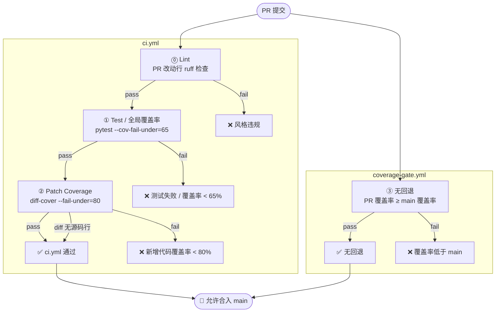

# CI 覆盖率门禁说明

本文档汇总当前 PR 合入 `main` 分支前必须通过的 **三道覆盖率门禁**，它们由 `.github/workflows/` 下的两个 workflow 共同实现，互补防护、缺一不可。

---

## 总览

| 门禁 | 工作流 / 作业 | 检查范围 | 阈值 | 解决的搭便车问题 |
|------|---------------|----------|------|------------------|
| ⓪ Lint | `ci.yml` · `lint` | PR：仅 PR 改动行；push to main：全树 soft-fail | ruff 0 violation on diff | 防止新增代码风格劣化（历史欠账不阻塞 PR） |
| ① 全局下限 | `ci.yml` · `test` | 仓库全量覆盖率 | **≥ 65%** | 防止整体测试体量被拆穿 |
| ② Patch coverage | `ci.yml` · `patch-coverage` | 本次 PR 新增/修改的行 | **≥ 80%** | 防止"全局达标但新增代码不带测试"搭便车 |
| ③ 无回退 | `coverage-gate.yml` · `coverage-regression` | 整体覆盖率 vs `main` | PR ≥ base | 防止覆盖率被慢性蚕食 |



> **65% 是过渡基线**：当前历史代码遗留部分覆盖空白，先以 65% 为绝对下限；后续待历史欠账还清后逐步上调，目标恢复至 80%。新增代码不享受此宽限，必须 ≥ 80%。

---

## 搭建步骤

### Step 0 — 前置依赖

本地与 CI 均需安装以下 Python 工具包：

```bash
pip install pytest pytest-cov diff-cover ruff
```

CI 中 `torch` 使用 CPU-only wheel 加速下载：

```bash
pip install torch --index-url https://download.pytorch.org/whl/cpu
```


---

### Step 1 — 配置 pytest.ini

在仓库根目录新建 `pytest.ini`，注册自定义 marker，避免 pytest 收集时报 `Unknown mark` 警告：

```ini
[pytest]
python_files = test_*.py
python_classes = Test*
python_functions = test_*
markers =
    network: tests requiring external network access
    slow: long-running tests (> 30s)
addopts = -v --tb=short
testpaths = tests
```

---

### Step 2 — 确认测试目录结构

pytest 对**有 `__init__.py`** 与**无 `__init__.py`** 的目录采用不同的导入模式：

| 情况 | pytest 行为 | 风险 |
|------|-------------|------|
| 有 `__init__.py` | package 模式，repo root 自动进 `sys.path` | 无 |
| 无 `__init__.py` | rootless 模式，仅把该目录加入 `sys.path` | `from python.zrt.X import ...` 找不到 `python` 包 |

**操作**：确保 `tests/` 下每一级子目录都有 `__init__.py`（空文件即可）：

```bash
# 检查哪些子目录缺少 __init__.py
find tests/ -type d | while read d; do
  [ ! -f "$d/__init__.py" ] && echo "MISSING: $d/__init__.py"
done
```

---

### Step 3 — 创建 ci.yml

文件路径：`.github/workflows/ci.yml`。包含四个 job：

#### ⓪ lint

- PR 触发：用 Python 脚本从 `git diff` 提取改动行号，与 `ruff --output-format=json` 输出交叉过滤，**只对 PR 新增/修改的行硬失败**，历史欠账不阻塞合入。
- push to main 触发：全树扫描，`continue-on-error: true`，仅可见不阻塞。

> **Lint 规则来源**：当前无 `ruff.toml` / `pyproject.toml`，ruff 使用**内置默认值**，仅启用 `E`（pycodestyle 错误）和 `F`（Pyflakes）两个规则集，等同于基础 flake8。如需扩展规则（isort、命名规范等），在仓库根目录创建 `ruff.toml` 即可。

#### ① test（全局覆盖率门禁）

```yaml
- name: Run tests
  run: |
    pytest tests/ \
      -m "not network" \
      --cov=python/zrt \
      --cov-report=xml:coverage.xml \
      --cov-report=term-missing \
      --cov-fail-under=${{ env.GLOBAL_COVERAGE_THRESHOLD }} \
      -q
```

生成的 `coverage.xml` 作为 artifact 上传，供下游 `patch-coverage` job 复用。

#### ② patch-coverage（新增代码覆盖率门禁）

```yaml
- name: Enforce patch coverage
  run: |
    diff-cover coverage.xml \
      --compare-branch=origin/${{ github.base_ref }} \
      --include "python/zrt/**/*.py" \
      --fail-under=${{ env.PATCH_COVERAGE_THRESHOLD }} \
      --html-report=patch-coverage.html
```

需声明 `needs: test` 以下载前一 job 的 `coverage.xml` artifact。

#### 阈值统一管理

在 `env` 块单点定义，所有 job 引用变量，后续调整只改一处：

```yaml
env:
  GLOBAL_COVERAGE_THRESHOLD: "65"   # 历史基线，目标 80
  PATCH_COVERAGE_THRESHOLD: "80"    # 新增代码严格要求
```

---

### Step 4 — 创建 coverage-gate.yml

文件路径：`.github/workflows/coverage-gate.yml`。仅在 `pull_request` 时触发。

核心逻辑：checkout base 分支 → 跑测试记录覆盖率 → checkout PR 分支 → 跑测试记录覆盖率 → 对比，PR 不得低于 base。

**关键设计点**：

```yaml
# base 分支加 --continue-on-collection-errors
# 防止"修复 broken main 的 PR 被 broken main 自身阻塞"死锁
pytest tests/ -m "not network" \
  --continue-on-collection-errors \
  --cov=python/zrt --cov-report=term -q 2>&1 | tee /tmp/base.txt || true
```

覆盖率数值用 Python 从 pytest-cov 输出的 `TOTAL xx%` 行解析，解析失败时 `sys.exit(1)`，防止输出格式变更导致静默误判。

---

### Step 5 — 配置 Branch Protection Rules

在 GitHub → Settings → Branches → main 的 Branch protection rules 中勾选以下项，确保 workflow 结果具有强制力：

- [x] Require status checks to pass before merging
  - 添加：`Lint`、`Test & Global Coverage Gate`、`Patch Coverage Gate`、`Coverage No-Regression Check`
- [x] Require branches to be up to date before merging
- [x] Do not allow bypassing the above settings

> **注意**：self-hosted runner 需在 runner label 与 workflow 的 `runs-on` 字段保持一致；同时将 `runs-on: ubuntu-latest` 改为实际 runner 标签（如 `[self-hosted, linux]`）。

---

## 门禁详解

### ① 全局覆盖率下限（≥ 65%）

- **作业**：`.github/workflows/ci.yml::test`
- **实现**：`pytest --cov=python/zrt --cov-fail-under=65`
- **触发**：`pull_request` 与 `push to main`
- **失败提示**：测试本身全部通过，但 `TOTAL` 行的 % 低于 65。
- **修复方向**：补充缺失模块的单测，或确认是否有大量代码未被任何测试 import。

### ② Patch coverage（PR diff ≥ 80%）

- **作业**：`.github/workflows/ci.yml::patch-coverage`
- **实现**：`diff-cover coverage.xml --compare-branch=origin/<base> --include "python/zrt/**/*.py" --fail-under=80`
- **触发**：仅 `pull_request`（`push to main` 不需要 diff 对比）
- **依赖**：`needs: test`，复用前一作业产生的 `coverage.xml`
- **统计范围**：只算 `python/zrt/**/*.py` 下被 PR 修改或新增的行。
- **自动豁免**：当 PR diff 不包含上述路径下的源码时（纯文档、配置、`tests/` 改动、重命名等），`diff-cover` 无可测行可统计，**自动放行**。
- **失败产物**：`patch-coverage.html` / `patch-coverage.md` 上传为 artifact，列出哪些新增行未覆盖。
- **修复方向**：为新加/改动的函数补单测，使被改动的行被至少一个 `pytest` 用例执行到。

### ③ 覆盖率无回退

- **作业**：`.github/workflows/coverage-gate.yml::coverage-regression`
- **实现**：分别在 base 分支和 PR 分支跑测试，对比 `TOTAL` 行百分比，PR 不得低于 base。
- **触发**：仅 `pull_request`
- **与 ① 的差异**：① 是绝对下限（65%），③ 是相对下限（不低于当前 main）。两者共同保证既不踩底也不退步。

---

## 本地预检

在推 PR 之前，本地可一次性跑完两步自查，避免 CI 反复 fail：

```bash
# 1. 跑测试并生成覆盖率报告（与 CI 同口径，跳过网络测试）
pytest tests/ -m "not network" --cov=python/zrt --cov-report=xml:coverage.xml -q

# 2. 对比 main 分支，检查 PR diff 覆盖率是否 ≥ 80%
diff-cover coverage.xml \
  --compare-branch=origin/main \
  --include "python/zrt/**/*.py" \
  --fail-under=80
```

若 `diff-cover` 报红，本地可加 `--html-report=patch-coverage.html` 生成可视化报告，浏览器打开即可定位未覆盖行。

**依赖一次性安装**：
```bash
pip install pytest pytest-cov diff-cover
```

---

## 常见问题

**Q1：我只改了文档/YAML/注释，为什么 `patch-coverage` 作业仍跑？**
作业本身仍会启动，但 `diff-cover` 检测到 diff 不含 `python/zrt/**/*.py` 后会直接打印"No lines with coverage information"并退出 0，不阻塞合入。

**Q2：我重构了一个文件、只是改名/移动函数，没新增逻辑，为什么 patch coverage 不达标？**
重构会让大量行被标记为"新增"，若旧测试无法覆盖到新位置就会卡。建议同 PR 里调整测试 import 路径或加一两个 smoke 测试覆盖到主路径。

**Q3：能否对某个 PR 临时豁免 patch coverage？**
当前未配置 label/路径白名单豁免。如确有特殊需要（例如纯生成代码、第三方代码引入），请在 PR 描述中说明，由 reviewer 评估后用管理员权限 override。**不要**通过 `# pragma: no cover` 大面积逃避检查。

**Q4：全局 65% 何时上调？**
跟踪 issue [#67](https://github.com/laksjdf/modeling/issues/67)。每月评估一次实际覆盖率，稳定 ≥ 阈值 + 5pp 后上调一档（65 → 70 → 75 → 80）。
调整方法：改 `.github/workflows/ci.yml::env.GLOBAL_COVERAGE_THRESHOLD` 单点即可，所有作业、job name、文档自动跟随。

---

## 相关文件

- `.github/workflows/ci.yml` — 门禁 ① ②（lint + test + patch-coverage）
- `.github/workflows/coverage-gate.yml` — 门禁 ③（no-regression）
- `pytest.ini` — markers 配置（`network` / `slow`）
- `requirements.txt` — 测试依赖
