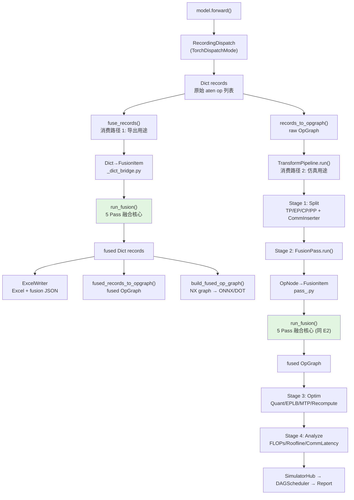
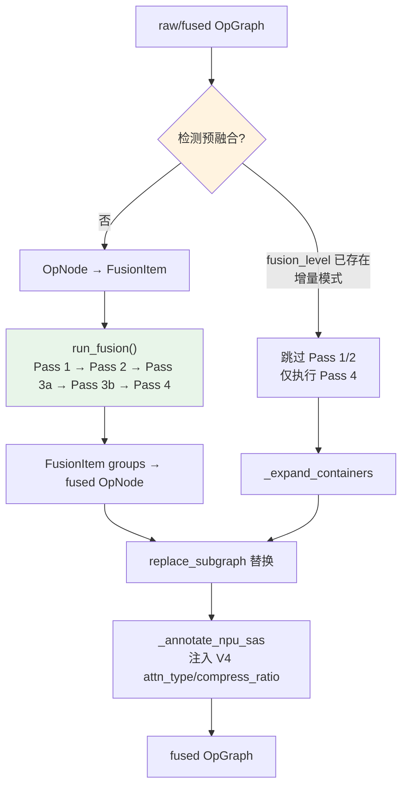

# ZRT 算子融合架构文档

> 基于代码路径：`python/zrt/transform/fusion/`、`python/zrt/graph/`、`python/zrt/pipeline.py`
> 状态：2026-05-11 整理

---

## 1. 整体架构定位

ZRT 的算子融合遵循**三层架构**：

```
Layer 1 — Capture (dispatch.py)
    记录所有 aten op，永不过滤。输出 Dict records。

Layer 2 — Fusion (fusion/)
    共享核心算法 core.run_fusion()，5 轮 Pass 完成分组、合并、标注、展开。
    跳过透明算子参与模式匹配，被吸收的算子保留在 _children 中。

Layer 3 — Display (excel_writer / 下游消费者)
    可选过滤用于可读性，独立于融合结果。
    改变显示层过滤对融合决策零影响。
```

融合逻辑是**单源真相**（single source of truth），全部集中在 `core.py`。两个消费入口（Dict Records 和 OpGraph IR）仅做数据格式转换，核心算法完全一致。

---

## 2. 数据流全景



**两个消费路径对比**：

| 维度 | 消费路径 1（Dict Records） | 消费路径 2（OpGraph IR） |
|------|---------------------------|-------------------------|
| 入口函数 | `fuse_records()` | `FusionPass.run()` |
| 输入 | raw Dict records | raw/fused OpGraph |
| 核心算法 | `core.run_fusion()` | `core.run_fusion()`（完全相同） |
| 转换层 | `_dict_bridge.py`（Dict↔FusionItem） | `pass_.py`（OpNode↔FusionItem） |
| 输出 | fused records → Excel/ONNX/DOT | fused OpGraph → 仿真链路 |
| 增量模式 | 不适用 | 若 `fusion_level` 已存在则跳过 Pass 1/2 |
| 特有逻辑 | `_compute_fused_io()` 计算融合 I/O | `_annotate_npu_sas()` 注入 V4 压缩标注 |

---

## 3. 融合核心算法（5 Pass 管线）


### 3.1 Pass 1: Leaf Grouping

**目标**：将连续的 compute/memory 节点按 `(scope, layer, phase)` 三元组分组成 leaf groups。

**规则**：
- 通信节点（`category == "communication"`）总是打断分组，成为独立单节点组
- 空 scope 节点总是打断分组
- forward/backward 不同 phase 不能跨组
- `max_leaf_ops` 上限：反向传播设 15，前向默认 60
- 同一 scope 内连续的计算节点被归入同一组

**伪代码**：
```python
for item in items:
    if item.category == "communication" or not item.scope:
        # 打断：当前组收尾 + 自身独立成组
        groups.append(current); groups.append([item]); current = []
        continue
    if same_scope and same_layer and same_phase and within_cap:
        current.append(item)   # 加入当前组
    else:
        groups.append(current)  # 收尾
        current = [item]        # 新组开始
```

### 3.2 Pass 2: Parent Merge

**目标**：合并连续 leaf groups，当它们共享一个"可融合"的父 scope。

**两条硬性规则**：
- **Rule 1**：根级模块（无 parent）是结构包装器，**永不融合**
- **Rule 2**：如果子 scope 有自己的 sub-children，父模块是结构模块，**不融合**

**平台限制**：
- `max_parent_ops`：父 scope 下总子算子数上限（CUDA=60, Ascend=50, CPU=20）
- `max_children`：父 scope 下唯一子路径数上限（CUDA/Ascend=8, CPU=6）

**合并逻辑**：
```python
if _is_fusible(parent):
    # 向后扫描连续的同父 groups
    while next_group.parent == parent and same_layer and same_phase:
        merged.extend(next_group)
    result.append(merged)
```

### 3.3 Pass 3a: Semantic Labeling（子模式匹配）

**目标**：为每个 group 确定融合后的 `op_type` 标签。

**优先级**（从高到低）：
1. **Platform SubPattern**：特定平台 + module class 正则 + op_seq 有序子序列匹配
2. **Semantic Label**：module class name 正则映射（如 `RMSNorm` → `rms_norm`）
3. **Fallback**：module class name 或第一个 op_type

**匹配算法**（`match_subsequence`）：
```python
def match_subsequence(op_names, pattern):
    # 1. 从 op_names 中移除 PATTERN_SKIP 算子
    effective = [op for op in op_names if op not in PATTERN_SKIP]
    # 2. 检查 pattern 是否作为有序子序列出现在 effective 中
    #    pattern 元素不需要连续，中间允许有其他计算算子
    i = 0
    for pat in pattern:
        while i < len(effective):
            if re.search(pat, effective[i]):
                i += 1; found = True; break
            i += 1
    return True
```

**安全保证**：Pass 1 已按 scope 分组，所以组内所有 ops 来自同一模块的计算。模块内顺序足以唯一标识 kernel（如 attention 的 `bmm→softmax→bmm` vs MLP 的 `mm→silu→mm`）。

### 3.4 Pass 3b: Add+Norm Cross-Boundary Fusion

**目标**：检测相邻的 `(residual-add group, norm group)` 对并合并。

**检测条件**：
1. `g_norm` 的语义标签是 `rms_norm` 或 `layer_norm`
2. `g_prev` 包含 `add` 算子（残差加）
3. `g_prev` 的 scope 是 `g_norm` scope 的父级（模块层次关系）

**输出标签**：`add_rms_norm` 或 `add_layer_norm`

**平台开关**：仅当 `add_norm_fusion=True`（CUDA 和 Ascend 启用，CPU 和 generic 关闭）

### 3.5 Pass 4: Expand Unfused Containers

**目标**：将未被任何硬件子模式匹配的 container group 展开为独立算子。

**逻辑**：
1. 检查 group 的 label 是否在 `CONTAINER_SEMANTICS` 中（`attn`, `mla_attn`, `mlp`, `moe_block`, `moe_shared`, `moe_expert`）
2. 如果是 container，检查是否有任何 subpattern 匹配其 module class（仅 class 匹配即可）
3. **没有匹配** → 展开：每个 child 成为独立的单节点组
4. **有匹配** → 保留融合状态

**设计意图**：防止 unfused 的 container 被一个通用的模块标签（如 `attn`）隐藏，确保未融合的 aten 算子对外可见。

---

## 4. 透明/跳过算子分层体系

融合在模式匹配时将算子分为 5 类，前 5 类全部跳过不参与模式锚点匹配：

| 类别 | 集合名 | 语义 | 是否计入 FLOP | 示例 |
|------|--------|------|:-----------:|------|
| 完全透明 | `ALWAYS_TRANSPARENT` | 纯元数据/autograd 簿记，零计算 | 否 | `detach`, `alias`, `is_same_size`, `prim.device` |
| 形变算子 | `SHAPE_OPS` | 仅改变 stride/size 元数据，不搬数据 | 否 | `view`, `_unsafe_view`, `permute`, `transpose`, `squeeze`, `unsqueeze`, `expand`, `as_strided`, `select`, `slice`, `split`, `unbind` |
| 初始化算子 | `INIT_OPS` | 内存初始化，保留记录但不做锚点 | 是（微小） | `zeros_like`, `ones_like`, `full`, `empty`, `arange`, `new_empty`, `scalar_tensor` |
| 常量提升 | `LIFT_OPS` | 内存拷贝（Inductor 降为 clone），跳过匹配 | 是 | `lift_fresh_copy`, `lift_fresh` |
| 潜在拷贝 | `POTENTIAL_COPY_OPS` | 总是分配新内存+拷贝，跳过匹配 | 是 | `clone`, `repeat`, `flip`, `_to_copy`, `copy_` |
| **正常算子** | — | **参与模式匹配的锚点** | 是 | `mm`, `bmm`, `softmax`, `addmm`, `silu`, `mean`, `rsqrt`, `pow`, `mul`, `topk` |

**关键注释**（来自 `rules.py`）：
- `aten.reshape.default` — 连续输入 → 调度为 `view.default`；非连续 → `clone.default + _unsafe_view.default`
- `aten.contiguous.memory_format` — 非连续输入调度为 `clone.default`；已连续输入返回 self
- 这两种的拷贝成本通过 `aten.clone.default` 捕获

---

## 5. 平台子模式（SubPattern）匹配体系

### 5.1 匹配规则

匹配是**两阶段**的：

1. **`module_re`** — group 的 `module_class` 必须完整匹配该正则（`re.fullmatch`，大小写不敏感）
2. **`op_seq`** — group 的有效 aten ops（PATTERN_SKIP 移除后）必须包含 `op_seq` 作为有序子序列（`re.search`）

两者都必须满足。空 `op_seq` 表示"仅按 class 匹配"。

### 5.2 CUDA 平台子模式表

| 优先级 | 融合标签 | module 正则 | op_seq 锚点 | 说明 |
|:------:|----------|------------|------------|------|
| 50 | `sdpa_backward` | Attention/Bwd | `_scaled_dot_product.*_backward` | SDPA 反向（单复合算子） |
| 46 | `v4_q_norm` | Attention | `square → rsqrt → view_as_complex` | V4 q 归一化 + RoPE（内联第二 RMSNorm） |
| 46 | `v4_kv_quant` | Attention | `view_as_complex → (amax\|clamp_min)` | V4 kv RoPE + act_quant 块级缩放 |
| 45 | `v4_sparse_attn` | Attention | `gather → bmm → softmax → bmm` | V4 稀疏注意力（gather 区分于 dense） |
| 42 | `attn_grad` | Attention/Bwd | `mm/bmm → _softmax_backward → mm/bmm` | 注意力梯度 dQ/dK/dV |
| 40 | `flash_attn` | Attention | `mm/bmm → softmax → mm/bmm` | 标准 SDPA aten 展开 |
| 38 | `norm_backward` | Norm | `native_layer_norm_backward\|_fused_rms_norm_backward` | 范数反向（融合 kernel） |
| 35 | `sdpa` | Attention | `scaled_dot_product_attention` | 原生 SDPA 调用 |
| 35 | `embedding_backward` | Embed | `embedding_dense_backward` | 嵌入反向 |
| 30 | `moe_gate_topk` | Gate/Router | `mm/linear → softmax/sigmoid/softplus → topk` | MoE topk 门控（含 softplus 覆盖 V4 sqrtsoftplus） |
| 28 | `gated_mlp_backward` | MLP | `mul → silu/gelu_backward → mm/addmm` | SwiGLU/GeGLU 反向 |
| 25 | `moe_gate` | Gate/Router | `mm/linear → softmax/sigmoid/softplus` | MoE 门控（无 topk，含 hash 路由） |
| 24 | `mlp_backward` | MLP | `silu/gelu/threshold_backward → mm/addmm` | 稠密 MLP 反向 |
| 20 | `gated_mlp` | MLP | `mm → silu/gelu/relu → mul → mm` | SwiGLU/GeGLU 前向 |
| 15 | `moe_dispatch` | MoE | `topk → index_select\|gather\|scatter` | MoE 路由分发 |

### 5.3 Ascend NPU 平台差异

额外子模式：

| 优先级 | 融合标签 | op_seq 锚点 | 说明 |
|:------:|----------|------------|------|
| 55 | `sdpa_backward` | `_scaled_dot_product.*_backward` | 同 CUDA，更高优先级 |
| 50 | `npu_add_rms_norm` | `add → pow\|mean\|rsqrt\|mul` | AddRMSNorm：残差加融合进范数（跨边界融合） |

### 5.4 共享正则

```python
_ATTN_RE    = ".*Attention.*|.*SelfAttn.*|.*MultiHead.*|.*MLA.*"
_GATE_RE    = ".*Gate.*|.*Router.*|.*MoEGate.*|.*MoeGate.*|.*TopkRouter.*"
_MLP_RE     = ".*MLP.*|.*FFN.*|.*FeedForward.*|.*PointwiseFF.*"
_MOE_RE     = ".*MoE.*|.*SparseMoe.*|.*Expert.*"
_NORM_RE    = ".*RMSNorm.*|.*LayerNorm.*|.*RmsNorm.*"
_EMBED_RE   = ".*Embed.*"
_ATTN_BWD_RE = ".*Attention.*|.*SelfAttn.*|.*MultiHead.*|.*MLA.*"
              "|.*DecoderLayer.*|.*EncoderLayer.*|.*TransformerLayer.*|.*Block.*"
```

---

## 6. 语义标签系统（Semantic Labels）

当子模式未匹配时，按 module class name 正则匹配语义标签。按**列表顺序**，第一个完整匹配获胜（大小写不敏感）：

```
HCPreAttn/HCPostAttn     → mhc_pre_attn/mhc_post_attn   (V4 超连接)
HCPreFfn/HCPostFfn       → mhc_pre_ffn/mhc_post_ffn
HCHead                   → mhc_head
RMSNorm/RmsNorm/NormHead → rms_norm
LayerNorm                → layer_norm
L2Norm                   → rms_norm
RotaryEmb/RoPE/YarnRotary→ rope
MLA/MultiLatentAttn      → mla_attn
Attention/SelfAttn       → attn
Gate                     → moe_gate            (精确匹配优先)
MoE/Moe/Expert/TopK/Gate → moe_gate
SparseMoeBlock/MoEBlock  → moe_block
MoE                      → moe_block            (DeepseekV2MoE 等纯 MoE 类)
SharedExpert             → moe_shared
Expert                   → moe_expert
MLP/FFN/FeedForward      → mlp
Embed                    → embedding
LMHead                   → lm_head
```

**Container 语义集合**：`attn`, `mla_attn`, `mlp`, `moe_block`, `moe_shared`, `moe_expert`

这些 container 标签如果没有被硬件子模式显式匹配，Pass 4 会将其展开为独立算子。

---

## 7. Platform Settings

| 平台 | `max_parent_ops` | `max_children` | `add_norm_fusion` |
|------|:---------------:|:-------------:|:-----------------:|
| `cuda` | 60 | 8 | ✅ |
| `ascend_npu` | 50 | 8 | ✅ |
| `cpu` | 20 | 6 | ❌ |
| `generic` | 30 | 5 | ❌ |

- `max_parent_ops`：父 scope 下总子算子数上限，超过则拒绝 parent merge
- `max_children`：父 scope 下唯一子路径数上限，超过则拒绝 parent merge
- `add_norm_fusion`：是否检测跨边界 Add+Norm → AddRMSNorm

---

## 8. FusionPass 在 TransformPipeline 中的集成



**增量模式**：当所有非通信节点已携带 `fusion_level`（来自 Stage-1 图捕获预融合），Pass 1/2（分组+父合并）被跳过，仅执行 Pass 3（语义重标注）和 Pass 4（展开未融合 container），复杂度从 O(n²) 降为 O(n)。

---

## 9. FusionItem 数据结构

所有 Pass 操作的统一中间表示：

```python
@dataclass
class FusionItem:
    scope: str           # module_path / OpNode.scope
    module_class: str    # Python class name (e.g. "RMSNorm", "Attention")
    op_type: str         # aten op name 或当前融合标签
    layer: str           # layer index
    phase: str           # prefill / decode / forward / backward
    category: str        # "compute" | "communication" | "memory"
    num_sub_ops: int     # 子算子计数
    children: list       # 原始子 records / nodes
    input_ids: list      # 输入 tensor IDs
    output_ids: list     # 输出 tensor IDs
    annotations: dict    # 标注（stage_id, phase 等）
    _meta: dict          # 调用方私有数据（node_id, node 引用等）
```

---

## 10. 关键设计原则

1. **先切分再融合**：TransformPipeline 中 Stage 1（并行切分）在 Stage 2（融合）之前执行。通信边界天然成为融合边界，融合规则不需要感知并行策略。

2. **显示层与融合层解耦**：改变 excel_writer 的显示过滤对融合决策零影响。模式匹配使用 PATTERN_SKIP 作为通配符，而非移除过滤器。

3. **被吸收算子保留在 _children**：透明算子和形变算子在模式匹配时被跳过，但它们仍然保留在融合组的 `_children` 中，FLOP/内存记账可以区分拷贝和纯形变。

4. **有序子序列而非连续匹配**：pattern 元素按顺序匹配但不需要连续，组内允许有中间计算算子（如注意力中的 QK 缩放 mul 或 mask add）。

5. **每 Pass 独立错误边界**：`run_fusion()` 中每个 Pass 被 try/except 包裹，一个 Pass 失败不会破坏前一个 Pass 的结果，仅记录 warning 日志。

6. **平台推断**：FusionPass 从 `hw_spec.vendor` / `hw_spec.device_type` 自动推断平台（nvidia → cuda, ascend/huawei/npu → ascend_npu），也可显式指定。

7. **反向传播保护**：反向传播时 `max_leaf_ops=15`（前向不设限），因为模块归属在 backward 中不可靠（forward hooks 不触发）。
